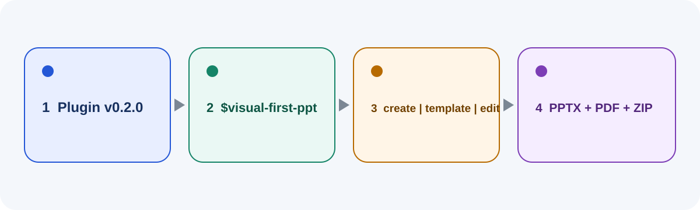

<!-- README_LANGUAGES: en | zh-CN | ja | ko -->

[English](README.md) | [简体中文](README.zh-CN.md) | [日本語](README.ja.md) | [한국어](README.ko.md)

# Visual-First PPT

<!-- BEGIN NEWBIE_QUICK_START -->
## 빠른 시작



### 1. 설정 대상을 먼저 확인합니다

무언가를 설치하기 전에 `SETUP_TARGET`을 확정하세요. `Plugin` 또는 `Skill-only` 중 하나를 선택하고 현재 상태가 새 설치, 기존 설치, 알 수 없음 중 무엇인지 밝힙니다. “이걸 되게 만든 다음 PPT도 만들어 줘”처럼 모호한 요청에서는 Codex가 설정과 프레젠테이션 제작을 서로 다른 단계로 처리해야 합니다. `SETUP_VERIFIED`에 도달하기 전에는 설치 범위를 추측하거나 프레젠테이션 경로를 먼저 선택하면 안 됩니다.

### 2. 고정 버전을 설치합니다

데스크톱에서는 Plugin 디렉터리에서 **Visual-First PPT**를 선택해 설치하는 방법이 가장 간단합니다. 명령줄은 처리 과정을 투명하게 보여 주는 대체 방법이며, 서로 분리된 두 작업을 실행합니다.

이 README에서 `codex`로 시작하는 명령은 사용자가 직접 실행하는 투명한 대체 절차입니다. 실행 중인 Codex Agent는 도구 동작에서 직접, Shell 또는 래퍼를 통해 `codex` 실행 파일(`codex plugin ...` 포함)을 실행해서는 안 됩니다. 현재 호스트가 직접 제공하는 관리 기능이나 아래의 `${CODEX_HOME:-$HOME/.codex}/skills/visual-first-ppt`로 제한된 읽기 전용 검사만 사용합니다.

```bash
codex plugin marketplace add banqiusheng/visual-first-ppt --ref v0.3.0
codex plugin add visual-first-ppt@visual-first-ppt-marketplace
```

첫 번째 명령은 `v0.3.0` 태그로 고정된 Marketplace를 등록할 뿐이며 Plugin을 설치하지 않습니다. 두 번째 명령이 Plugin을 설치합니다. Plugin 설치 후에는 새 Codex 작업을 시작하세요.

Skill만 설치하려면 다음 프롬프트를 Codex에 붙여 넣으세요.

```text
$skill-installer를 사용하여 다음 고정 버전에서 visual-first-ppt를 설치해 주세요:
https://github.com/banqiusheng/visual-first-ppt/tree/v0.3.0/skills/visual-first-ppt
설치 전에 같은 이름의 Skill이 있는지 확인하고, 이미 있으면 EXISTING_INSTALLATION으로 중단한 뒤 덮어쓰지 마세요.
설치 후 새 Codex 작업이 필요한지와 $visual-first-ppt로 시작하는 방법을 알려 주세요.
설치 방법만 설명하는 경우든 실제로 설치하는 경우든, 설치된 복사본의 doctor 명령, 예상 결과와 실제 결과, 활성화 확인, setup 상태를 포함한 전체 verification_plan 블록으로 답변을 끝내세요.
```

### 3. 성공이라고 말하기 전에 검증합니다

설치 명령이 끝났다는 사실만으로 제품을 사용할 수 있다고 판단하면 안 됩니다. `node skills/visual-first-ppt/scripts/doctor.mjs --json`는 저장소 복사본을 검사할 뿐 설치된 복사본의 검증을 대신하지 않습니다. 기본 Skill-only 설치에서는 다음을 실행하세요.

```bash
SKILL_ROOT="${CODEX_HOME:-$HOME/.codex}/skills/visual-first-ppt"
node "$SKILL_ROOT/scripts/doctor.mjs" --skill-root "$SKILL_ROOT" --json
```

Plugin을 설치했다면 현재 호스트가 직접 노출한 Skill 루트와 Plugin 정보만 사용하세요. 호스트가 해당 루트를 노출하지 않으면 중단하고 차단 사유를 설명하세요. Plugin 관리 저장소를 추측하거나 스캔하지 마세요. 노출된 루트에 위 doctor 검사를 실행한 다음 새 Codex 작업을 시작해 `$visual-first-ppt`를 명시적으로 호출합니다. 설치된 진입점, doctor 결과, 활성화 확인에 모두 근거가 있을 때만 `SETUP_VERIFIED`를 기록하세요. doctor 종료 코드 `2`는 필수 로컬 파일이 확인됐다는 뜻이지만 선택적 제작 기능은 아직 확인되지 않았습니다. 이를 완전한 PPT 제작 준비 완료로 표현하지 마세요. 전체 진단 순서는 `SUPPORT.md`에 있습니다.

<!-- BEGIN INSTALL_VERIFICATION_RESPONSE -->
설치를 실행하지 않고 안내만 하는 경우를 포함해 설치 관련 모든 답변은 다음 필드를 이 순서대로 마지막에 기록해야 합니다. “설치하고 검증”이라고만 쓰는 것은 구체적인 검증 방법이 아닙니다.

- `verification_plan`: `REQUIRED`.
- `installed_target`: 정확한 설치 Skill 루트 또는 호스트가 노출한 Plugin Skill 루트.
- `doctor_command`: Skill-only는 `SKILL_ROOT="${CODEX_HOME:-$HOME/.codex}/skills/visual-first-ppt"`를 설정한 뒤 `node "$SKILL_ROOT/scripts/doctor.mjs" --skill-root "$SKILL_ROOT" --json`를 실행합니다. Plugin은 호스트가 직접 노출한 정확한 Skill 루트만 대입합니다.
- `expected_doctor_result`: `exit 0`과 JSON `PASS`는 모든 필수 검사가 통과했음을, `exit 2`와 JSON `WARN`은 로컬 요구 사항만 통과하고 노출되지 않은 제작 기능은 미확인임을, `exit 1`과 JSON `FAIL`은 사용 불가임을 뜻합니다.
- `doctor_result`: 실제 종료 코드와 JSON 상태. 안내만 한 경우 `NOT_RUN`, 설치 루트나 검사를 사용할 수 없는 경우 `NOT_AVAILABLE`.
- `activation_check`: 새 Codex 턴 또는 작업에서 `$visual-first-ppt`를 명시적으로 호출한 결과.
- `setup_status`: 설치된 진입점, doctor 결과, 활성화 확인의 근거가 모두 갖춰질 때까지 `SETUP_NOT_VERIFIED`를 기록하고, 모두 확인된 뒤에만 `SETUP_VERIFIED`를 기록합니다.
<!-- END INSTALL_VERIFICATION_RESPONSE -->

### 4. 기존 설치는 복구 가능하게 처리합니다

설정이 `EXISTING_INSTALLATION`으로 중단되면 덮어쓰지 마세요. 다음 프롬프트를 Codex에 붙여 넣으세요.

```text
기존 visual-first-ppt가 있을 수 있습니다. 읽기 전용으로 확인하고 정확한 대상이 Skill-only인지 Plugin인지 먼저 구분하세요. 이름이 비슷한 프로젝트 데이터 디렉터리를 설치로 오인하지 마세요. 실제 설치를 찾지 못하면 EXISTING_INSTALLATION_NOT_FOUND를 보고하고 확인한 위치와 후보 버전 v0.3.0을 제시한 뒤 정확한 경로를 요청하거나 새 설치를 선택하게 하세요. 이 경우에는 업그레이드 승인을 요청하지 마세요.
Skill-only 복구: 이 작업은 설정 또는 업그레이드 작업이며 PPT 제작 작업이 아닙니다. 설치된 $visual-first-ppt 워크플로를 호출하지 마세요. ${CODEX_HOME:-$HOME/.codex}/skills/visual-first-ppt를 먼저 확인하고, 사용자가 명시적으로 제공한 경우에만 다른 절대 Skill 경로를 확인하세요. codex 실행 파일을 실행하거나 홈 디렉터리를 제한 없이 검색하지 마세요. 인증 파일을 읽지 마세요. 관련 없는 환경을 열거하지 마세요. 정확한 Skill 대상과 고정된 v0.3.0을 읽기 전용 버전 또는 콘텐츠 비교로 확인하고 차이와 정확한 경로를 보여 준 뒤, 경로가 지정된 UPGRADE_APPROVED 결정에서 멈추세요. 승인 후에만 기존 Skill을 타임스탬프가 있는 동일 계층 백업으로 이동하고 새 대상에 설치한 뒤 doctor와 명시적인 $visual-first-ppt 활성화 검사를 실행하세요. 설치나 검증이 실패하면 ROLLBACK을 수행하고 백업을 복원하세요. 기존 복사본을 병합하거나 재귀 삭제하지 마세요.
Plugin 복구: 현재 호스트가 직접 제공하는 Plugin 제어만 사용하세요. 실행 중인 작업 안에서 codex plugin 명령을 실행하지 마세요. Codex가 지원하는 Plugin 관리, 업데이트, 롤백 제어만 사용하세요. Plugin 관리 저장소를 추측하거나 이동, 이름 변경, 재귀 삭제하지 마세요. 지원되는 복구 가능한 업데이트 또는 롤백 경로를 확인할 수 없으면 중단하고 차단 사유를 설명하세요. 이 경우 `UPGRADE_APPROVED`를 요청하거나 사용하지 마세요.
```

### 5. 첫 프레젠테이션을 시작합니다

`Presentations` 또는 `imagegen`이 없거나 검증되지 않았다면 사용할 수 있는 것처럼 가장하거나 최종 파일을 주장하지 말고, 먼저 정확한 재개 지점을 다음 형식으로 보고하세요.

<!-- BEGIN CAPABILITY_RECOVERY_RESPONSE -->
- `capability_status`: `BLOCKED_CAPABILITY`.
- `missing_capabilities`: `Presentations`와 `imagegen` 중 없거나 검증되지 않은 항목을 정확히 나열합니다.
- `resume_after_capabilities_ready`: 현재 호스트가 두 기능을 모두 노출하고 검증한 뒤 새 Codex 작업을 시작하고 `$visual-first-ppt`를 명시적으로 호출합니다.
- `resume_without_manifest`: `ROUTE_SELECTION_OR_BRIEF`. `create`, `template`, `edit` 중 하나를 선택하고 Brief부터 계속합니다.
- `resume_with_manifest`: `project-manifest.json` 또는 제공된 project ID를 검증한 뒤 기록된 `RECORDED_GATE`에서만 재개합니다.
<!-- END CAPABILITY_RECOVERY_RESPONSE -->

Skill 설치와 검증이 끝난 다음 턴에 명시적으로 호출하세요. 감지되지 않으면 새 Codex 작업을 시작합니다. 이후 다음 프롬프트로 시작하세요.

```text
$visual-first-ppt를 사용해 주세요. 먼저 create, template, edit 세 경로 중 하나를 선택하게 하고 전체 제작 전에 필요한 승인 단계를 따르세요.
```

첫 응답이 경로 선택과 승인 절차에서 멈추는 것은 정상적인 설계이며 작업이 중단된 것이 아닙니다.
<!-- END NEWBIE_QUICK_START -->

`visual-first-ppt`는 단계별 승인 절차와 비주얼 우선 워크플로를 통해 프레젠테이션 덱을 제작하는 Codex Skill입니다. 처음부터 덱을 만들거나, 기존 템플릿 또는 프레임워크를 따르거나, 기존 PPTX를 승인된 범위 안에서 수정할 수 있습니다.

생성 이미지는 분위기, 장면, 시각적 보조 요소를 담당합니다. 핵심 텍스트, 정확한 수치, 표, 차트, 인용, 승인 근거는 PowerPoint 네이티브 객체로 유지되어 편집할 수 있습니다. 결과물은 단순히 보기 좋은 파일에 그치지 않습니다. 명시적 승인, QA 근거, 영구 보관 가능한 인계 경로를 갖춘 검토 가능한 납품 패키지입니다.

> 커뮤니티 프로젝트입니다. 이 저장소는 OpenAI의 공식 제품이 아닙니다.

## 이 Skill을 사용하는 이유

프레젠테이션 작업은 대개 두 가지 문제 중 하나에 부딪힙니다. 편집은 가능하지만 시각적으로 평범하거나, 완성도는 높아 보여도 이미지로 평면화되어 검증과 수정이 어렵습니다. 이 Skill은 두 계층을 결합합니다.

- 시각적 방향과 설명용 장면을 위한 이미지 생성
- 사실 정보나 변경 가능성이 있는 콘텐츠를 위한 PowerPoint 네이티브 객체
- 비용이 큰 작업을 계속하기 전의 명시적 승인 단계
- 수정, 패키징, 최종 인계를 위한 결정론적 검사
- 사용자에게 원본 자료가 없을 때 수행하는 공개 웹 조사와 출처·추론의 명확한 구분

사용자에게 템플릿이 없으면, 이 Skill은 대상 청중과 주제에 맞는 테마 방향을 제안하고 슬라이드 제작 전에 하나를 확정합니다.

## 지원 경로

| 경로 | 사용 시점 | 필요한 사용자 승인 단계 |
| --- | --- | --- |
| `create` | 처음부터 덱을 제작할 때 | `[OUTLINE_APPROVED]` → `[VISUAL_LOCKED]` → `[FINAL_APPROVED]` |
| `template` | 기존 PPTX, 테마 또는 콘텐츠 프레임워크를 따를 때 | `[OUTLINE_APPROVED]` → `[VISUAL_LOCKED]` → `[FINAL_APPROVED]` |
| `edit` | 승인된 범위 안에서 기존 PPTX를 변경할 때 | `[SCOPE_APPROVED]` → 변경 미리보기 → `[FINAL_APPROVED]` |

이 Skill은 “그냥 진행해 주세요”라는 말, 사용자의 침묵, 파일 업로드를 이러한 승인 단계를 건너뛰어도 된다는 허가로 해석하지 않습니다.

## 워크플로 진행 방식

1. **경로를 선택합니다.** Codex는 콘텐츠를 검토하거나 제작하기 전에 `create`, `template`, `edit` 중 하나를 확인합니다.
2. **입력 자료를 수집합니다.** `template`과 `edit`에서는 사용자가 원본 PPTX와 보유 자료를 제공합니다. `create`에서는 Codex가 대상 청중, 목표, 강조점, 분량, 제약 조건을 확인합니다.
3. **책임 있게 조사합니다.** 사용자 자료를 우선합니다. 자료가 충분하지 않으면 Codex가 공개 출처를 조사하고, 출처 이력을 기록하며, 상충되는 내용을 드러내고, 근거 없는 주장을 피할 수 있습니다.
4. **구조와 시각적 방향을 승인합니다.** 사용자는 전체 제작 전에 개요를 검토하고, 해당하는 경우 시각 시스템을 확정합니다. `edit` 프로젝트는 먼저 수정이 허용된 슬라이드 범위를 확정합니다.
5. **제작하고 검토합니다.** 모든 슬라이드를 렌더링합니다. 핵심 콘텐츠는 PowerPoint 네이티브 객체로 유지하고, 생성 이미지는 선언된 안전 영역 안에 배치합니다. `edit` 프로젝트에서 수정이 승인되지 않은 슬라이드에는 PNG 및 XML 비교 근거를 제공합니다.
6. **검증하고 납품합니다.** 자동 QA, 전체 크기 슬라이드 검토, 대상 클라이언트 스모크 테스트 또는 사용자의 파일 열기 확인, 최종 승인, 결정론적 패키징, 영구 보관 경로 검증은 각각 별도의 단계입니다.

## 핵심 보호 장치

- 현재 Codex의 `Presentations` 워크플로와 `@oai/artifact-tool`을 사용하며, `python-pptx`는 사용하지 않습니다.
- 시각 계층에는 `imagegen`을 사용하지만, 사실 기반 텍스트나 정확한 데이터의 최종 원본으로는 사용하지 않습니다.
- 입력 덱을 보존하고, 범위가 제한된 수정 결과는 새 출력 파일로 작성합니다.
- 사용자가 문서화된 품질 저하를 명시적으로 승인하지 않는 한, 지원되지 않거나 위험한 호환성 변경을 차단합니다.
- 선언된 대상 루트 밖에 있거나 운영체제 및 도구가 관리하는 임시, 캐시, 스크래치 경로 안에 있는 최종 파일을 거부합니다.
- 편집 가능한 PPTX 1개, PDF 1개, 미리보기, 제작 기록, 결정론적 ZIP을 정확히 하나의 패키지로 구성합니다.

### 시각 품질 게이트

- 네이티브 텍스트는 편집 가능한 상태로 유지하며, 생성 이미지는 분위기와 장면을 보조할 뿐 사실 문구나 정확한 데이터를 담지 않습니다.
- 내용이 빽빽한 페이지는 분할될 수 있으며, 승인된 내용을 작게 줄이거나 잘라 내는 대신 완전한 의미 단위로 나눕니다.
- 글꼴 대체가 발생하면 전달을 차단하고, 검증된 대체 글꼴을 선택한 뒤 시각 샘플을 다시 승인해야 합니다.
- `template` 및 `edit`의 보존 대상 페이지는 새 페이지 규칙에 맞추려고 다시 서식화하지 않고 호환성 및 미변경 근거로 확인합니다.
- legacy 프로젝트는 읽을 수 있지만 마이그레이션을 완료한 뒤에만 다시 빌드하고 새 QA 근거를 만들거나 재패키징 및 재전달할 수 있습니다.

## 요구 사항

- 현재 `Presentations` 및 `imagegen` Skill 또는 기능을 사용할 수 있는 Codex 환경
- 프로젝트 상태 및 QA 스크립트 실행을 위한 Node.js 20 이상
- 비교, 패키징, 인계 검증을 위한 Python 3.10 이상
- 개발 시 공식 Skill 검증에만 필요한 `PyYAML==6.0.2`

이 저장소에는 Codex, PowerPoint, WPS, LibreOffice, `Presentations`, `imagegen`, `@oai/artifact-tool`이 포함되어 있지 않습니다.

## 설치

재현 가능한 설치를 위해 공개된 릴리스 태그를 클론한 뒤, 배포 가능한 Skill 디렉터리만 복사합니다.

```bash
git clone --branch v0.3.0 --depth 1 \
  https://github.com/banqiusheng/visual-first-ppt.git
cd visual-first-ppt

DEST="${CODEX_HOME:-$HOME/.codex}/skills/visual-first-ppt"
test ! -e "$DEST"
mkdir -p "$(dirname "$DEST")"
cp -R skills/visual-first-ppt "$DEST"
node "$DEST/scripts/doctor.mjs" --skill-root "$DEST" --json
```

`test ! -e` 보호 절차는 기존 Skill을 실수로 덮어쓰는 일을 방지합니다. 위의 마지막 명령은 저장소 복사본이 아니라 `$DEST`에 설치된 복사본을 대상으로 doctor를 실행합니다. 빠른 시작 3단계에 따라 `PASS`, `WARN`, `FAIL`을 해석하고 활성화 확인을 완료하세요. 두 항목 모두 근거가 갖춰지기 전에는 `SETUP_VERIFIED`로 기록하지 마세요. 복사 후 다음 Codex 턴에서 먼저 `$visual-first-ppt`를 명시적으로 호출하세요. 감지되지 않을 때만 새 Codex 작업을 시작한 뒤 다시 명시적으로 호출하세요.

## 요청 예시

```text
Codex, 전문대학 총장을 대상으로 한 AI 교육 파일럿 제안서를 처음부터 만들어 주세요.

제가 업로드한 PPT 템플릿과 콘텐츠 프레임워크를 사용해 12장 분량의 솔루션 덱을 만들어 주세요.

기존 PPT에서 4번과 7번 슬라이드만 변경해 주세요. 다른 모든 슬라이드는 그대로 유지하고 비교 근거를 제공해 주세요.
```

첫 번째 응답은 의도적으로 경로 선택과 해당 승인 조건 안내까지만 진행한 뒤 멈춥니다.

## 최종 인계 계약

제작 및 렌더링 작업에는 스크래치 디렉터리를 사용할 수 있습니다. 최종 응답 전에 승인된 PPTX, PDF, ZIP을 현재 워크스페이스 아래의 영구 보관 디렉터리나 사용자가 선택한 대상 경로로 복사한 뒤 다음 명령을 실행합니다.

```bash
python3 skills/visual-first-ppt/scripts/verify_handoff_paths.py \
  --persistent-root /persistent/output \
  /persistent/output/deck.pptx \
  /persistent/output/deck.pdf \
  /persistent/output/deck-delivery.zip
```

검증된 영구 보관 위치의 복사본만 사용자에게 링크해야 합니다. `DELIVERED` 전환에는 승인된 PPTX와 대상 루트도 연결해야 합니다.

```bash
node skills/visual-first-ppt/scripts/project-state.mjs transition \
  WORKSPACE DELIVERED APPROVED_PPTX_HASH \
  /persistent/output /persistent/output/deck.pptx
```

## 로컬 검증

```bash
python3 -m venv .venv
.venv/bin/pip install -r requirements-dev.txt

node --test tests/unit/*.test.mjs
PYTHONDONTWRITEBYTECODE=1 .venv/bin/python \
  -m unittest discover -s tests/unit -p 'test_*.py' -v

SKILL_CREATOR="${CODEX_HOME:-$HOME/.codex}/skills/.system/skill-creator"
.venv/bin/python "$SKILL_CREATOR/scripts/quick_validate.py" \
  skills/visual-first-ppt
```

## 검증 근거

- 저장소의 Node 및 Python 테스트 스위트는 실행 가능한 릴리스 증거입니다. 릴리스 검증에서는 모든 테스트가 통과해야 하며, 각 실행이 정확한 현재 개수를 보고하므로 README에 오래될 수 있는 고정 총계를 남기지 않습니다.
- 15/15 RED 압박 샘플에서 Skill 없이 실행했을 때 각각 하나 이상의 필수 계약 항목이 누락되었습니다.
- 15/15 GREEN 동작 실행이 통과했으며, 필수 항목 75/75가 통과하고 금지 동작 30/30이 발생하지 않았습니다.
- 합성 `create`, 엄격한 `template`, 범위가 제한된 `edit` 경로가 QA PASS 상태로 `DELIVERED`에 도달했습니다. 요약 결과와 해시는 [`tests/artifacts/artifact-summary.json`](tests/artifacts/artifact-summary.json)에 있습니다.
- 세 합성 픽스처 모두 LibreOffice Impress 헤드리스 가져오기/내보내기 스모크 테스트를 통과했습니다. 이는 Microsoft PowerPoint GUI 검증을 주장하는 것이 아닙니다.
- 이 워크플로로 별도 제작한 교육 고객 대상 10장 분량의 파일럿은 사용자가 2026-07-14에 PowerPoint/WPS에서 열었으며, 보고된 이상은 없었습니다. 해당 고객용 덱은 이 저장소에 포함되어 있지 않습니다.

간결한 동작 기록은 [`tests/baseline/summary.json`](tests/baseline/summary.json)과 [`tests/green/summary.json`](tests/green/summary.json)에 보관됩니다. 원시 실행 로그, 고객 자료, 생성된 덱 산출물은 공개 저장소 외부에 유지되며, 재사용 가능한 향후 테스트 지원 스크립트는 `tests/artifacts/support/` 아래에 유지됩니다.

## 제한 사항

- 템플릿 충실도는 원본 덱의 호환성에 따라 달라지며, 추정하지 않고 근거로 입증해야 합니다.
- 애니메이션, SmartArt, OLE 객체, 연결된 미디어, 복잡한 마스터, 누락된 글꼴, 전역 테마 변경으로 인해 편집이 차단되거나 명시적인 품질 저하 승인이 필요할 수 있습니다.
- 래스터 PDF는 외형은 보존하지만 텍스트 검색이나 편집은 지원하지 않습니다. 제작 기록에 PDF 유형을 공개해야 합니다.
- 최종 호환성은 실제 대상 클라이언트, 글꼴 가용성, 환경에 따라 달라집니다.
- 생성된 장면은 설명용 시각 자료이며, 실제 학교, 고객 또는 완료된 프로젝트의 증거로 제시해서는 안 됩니다.

## 저장소 구조

- `skills/visual-first-ppt/` — 배포 가능한 Skill
- `tests/unit/` — 결정론적 Node 및 Python 테스트
- `tests/fixtures/` — 소규모 중립 PPTX 및 텍스트 픽스처
- `tests/scenarios/` — RED/GREEN 시나리오 정의 및 프롬프트 도구
- `tests/artifacts/support/` — 세 가지 경로의 향후 테스트에 재사용할 수 있는 지원 스크립트. 생성된 출력은 로컬에 유지됩니다.
- `tests/*/summary.json` — 보관되는 간결한 근거. 대용량 생성 산출물은 로컬에 유지됩니다.

## 릴리스 및 라이선스

- 현재 릴리스: [`v0.3.0`](https://github.com/banqiusheng/visual-first-ppt/releases/tag/v0.3.0)
- 릴리스 기록: [`CHANGELOG.md`](CHANGELOG.md)
- 라이선스: MIT — [`LICENSE`](LICENSE) 참조
